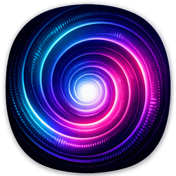

<p align="center"></p>

# Trippin

Live, music-reactive visuals for DJ sets. Trippin listens
to whatever your DJ software is playing and drives GPU shader scenes from it. It
tracks band energy, onsets, tempo and beat phase, and an auto-pilot cuts between
scenes on phrase boundaries and drops.

## Install

Download `Trippin-Setup-<version>.exe` from the GitHub **Releases** page (or
from the artifacts of the latest *Build installer* workflow run) and run it.
Settings are saved to `%APPDATA%\Trippin	rippin.json`.

To release a new version: **Actions → Build installer → Run workflow**, enter
the version (e.g. `0.2.0`) — it bumps `Cargo.toml`, commits, tags `v<version>`,
builds the installer and publishes the release. Or do it by hand: bump
`version` in `Cargo.toml`, then `git tag v0.2.0 && git push origin v0.2.0`.
Every push to `master` also builds an installer artifact.

Build the installer locally (needs Inno Setup 6):

```
cargo build --release --features gui
"C:\Program Files (x86)\Inno Setup 6\ISCC.exe" /DAppVersion=0.1.0 installer	rippin.iss
```

### macOS

CI also builds `Trippin.app` as a universal binary (Intel + Apple Silicon) —
grab `Trippin-macOS-<version>.zip` from releases or workflow artifacts, unzip,
and drag to Applications. CI artifacts are signed and notarized when the
signing secrets below are configured, so they open like any other app;
unsigned builds still hit Gatekeeper — `xattr -dr com.apple.quarantine
Trippin.app`, or attempt to open then **System Settings → Privacy &
Security → Open Anyway**.

#### Signing secrets (repo → Settings → Secrets and variables → Actions)

- `APPLE_CERTIFICATE` — base64 of a **Developer ID Application** cert +
  private key exported as `.p12` (Keychain Access → export, or Xcode →
  Manage Certificates → Developer ID Application first). Encode with
  `base64 -i cert.p12 | pbcopy`.
- `APPLE_CERTIFICATE_PASSWORD` — the `.p12` export password.
- `APPLE_SIGNING_IDENTITY` — e.g. `Developer ID Application: Name (TEAMID)`;
  `security find-identity -v -p codesigning` prints the exact string.
- `APPLE_ID` — the Apple ID email for notarization.
- `APPLE_PASSWORD` — an **app-specific password** for that account
  (appleid.apple.com → Sign-In and Security → App-Specific Passwords).
- `APPLE_TEAM_ID` — the 10-char team ID (developer.apple.com → Membership).

Settings live in `~/Library/Application Support/Trippin/trippin.json`. Shaders
and dancers resolve from the bundle's `Contents/Resources/`; running from a
checkout uses the repo directories as before.

**Audio:** macOS captures the system output mix directly via ScreenCaptureKit
— the same API OBS uses — so no mic or BlackHole loopback is needed. macOS
prompts once for screen/system-audio recording permission on first launch
(macOS 13+; on older systems it falls back to the default input). `--mic`
forces the microphone, and `--device "<name>"` picks a specific input or
interface for a DJ booth-out. `--list-devices` shows what's available.
The panel key is **P** on macOS (F1 is a brightness key on Touch Bar
machines; Fn+F1 also works). On macOS, presents are ungated from vsync and
the render
loop self-paces at the display's refresh — vsync-gated presents stall ~2
frames whenever the compositor is loaded (e.g. another app fullscreen on a
second display); `--vsync` restores them if that ever causes trouble.

## Run

```
cargo run --release                         # capture what you hear (loopback / system audio)
cargo run --release -- --list-devices       # list capture devices
cargo run --release -- --device "Serato"    # a specific input (or output-as-loopback)
cargo run --release -- --mic                # force the default input instead of system audio
cargo run --release -- --scene tunnel       # start on a scene, auto-pilot off
cargo run --release -- --dancer neon --canon  # force a dancer look (auto-pilot changes it on cuts)
cargo run --release -- --no-dancer          # start with the dancer layer off
cargo run --release -- --no-panel           # no control panel window
cargo run --release -- --gpu low            # use the integrated GPU (renders at 75% by default)
cargo run --release -- --scale 0.6          # scene render resolution, upscaled to the window
cargo run --release -- --vsync              # macOS: vsync-gated presents instead of the default
cargo run --release -- --fullscreen
```

Drag the visuals window to the projector / LED wall and press **F**. A
**control panel** window opens alongside it (F1 shows/hides it), organised
into tabs — **Show** (modes, scene stepping, length, blackout, fullscreen,
latency/downbeat), **Scenes** (the playlist: tick to include, search filter,
"show" to jump to one now), **Dancer** (on/off, look, canon, size, which
routines), **Effects** (the post effect + strength — picks apply live to the
output, so the panel doubles as a preview) and **Keys** (rebindable hotkeys:
click Rebind, then press a key). Everything is saved to `trippin.json`, and
the visuals keep animating while the panel is being moved — rendering runs
on its own thread.

**Modes:** *Auto* cuts scenes every phrase and early on drops, and the dancer
follows the track. *Static* holds the current scene while the dancer still
changes with the phrases. *Manual* changes nothing by itself.

Default keys (all rebindable in the panel):

| Key | Action |
|---|---|
| → / ← | next / previous scene (next is random in random order) |
| A / H / M | mode: auto / static (hold) / manual |
| R | random ↔ sequential scene order |
| D | dancer on / off |
| C / S / V | next routine / next look / canon auto→on→off |
| B | blackout (fade to black and back) |
| F | fullscreen on / off |
| Space | mark this beat as the downbeat |
| [ / ] | latency −/+ 5 ms |
| X | cycle the post effect (off → mirrors → kaleido) |
| F5 | reload shaders |
| F1 (P on macOS) | show / hide the control panel |
| Esc | leave fullscreen (it never quits; close the window to quit) |

## Scenes

- **Tunnels / flights:** `neon_portals` (neon triangle, square and hexagon
  portals over a wet reflective floor; the shape and twist change per cut),
  `block_tunnel` (a curving tunnel of jutting boxes, either red monochrome or
  dark metal with neon edges), `fractal_flight`, `portal_zoom` (endless Droste
  portal zoom), `tunnel` and `synthwave`. These move on `u.flow`, a smooth
  tempo clock that never jumps, and they have no beat flashes, so the flight
  stays fluid.
- **Scenery:** `ocean` (sunset sea), `clouds` (sunset cloud flight),
  `city_rain` (neon street in the rain, wet-asphalt reflections),
  `highlands` (misty mountain valley at dawn), `dunes` (desert at dusk),
  `beach` (palm silhouettes and surf), `aurora` (northern lights whose
  curtains fold and shimmer to the spectrum over a mountain lake) and
  `laser_show` (festival beam fans over a crowd). Flight
  scenes ride `u.flow`; nothing flashes.
- **Mandalas / abstract:** `fire_mandala` (a fire-and-ice kaleidoscope),
  `julia_portal`, `kaleido`, `fluid` and `spectrum_rings`. These still pulse
  with the beat.
- **Analysers** — scenes that draw the music itself: `eq_bars` (mirrored
  spectrum bars), `eq_round` (radial analyser), `eq_skyline` (a city skyline
  of spectrum towers), `scope` (phosphor oscilloscope), `spectrogram`
  (scrolling waterfall), `lissajous`, `vu` (giant bass/mid/high meters),
  `led_wall`, `waveshaper`, `polar_bloom`, `levels` and `terrain`
  (a wireframe spectrum valley).
- **Pulse / particle:** `shockwaves`, `pulse_grid`, `rings`, `heartbeat`
  (a scrolling ECG), `bounce`, `stardrive`, `orbiters`, `ribbons`, `ink`,
  `metaballs`, `sparks` (pyro fountains), `sun_rays`, `helix`,
  `voronoi_pulse`, `chevrons` and `pixel_fall`. Ring bursts ride the beat,
  onset splats and fountains fire on drops, trails live in the feedback
  buffer.
- **Seasonal:** `halloween`, `christmas` and `fireworks` only enter the
  playlist in season (October, December, Bonfire Night and New Year; see
  `Seasonal` in the panel). They're the most audio-reactive scenes:
  beat-flickering lanterns, onset lightning, and bursts that barrage on drops.

Heaviest on integrated graphics (at the automatic 75% scale): `block_tunnel`
~57 fps and `fire_mandala` ~84 fps at 2560×1440. Every scene holds 144 fps on
an RTX 5070 Ti.

When writing a scene, use `u.flow` for camera travel. `u.beat` gets phase
corrections from the beat tracker, so motion driven by it stutters.

## Visual effects

A post effect transforms the whole frame — scene and dancer — chosen in the
panel or with `X`: **Mirror X**, **Mirror Y**, **Quad mirror** or **Kaleido
×6 / ×8**. The **Strength** slider blends the transform in (at 50% a mirror
sits over the plain frame). **Auto** picks a fresh effect on every scene cut
(Mirror Y stays manual-only — an upside-down dancer reads as a glitch).
It's applied in `present.wgsl` from `u.fx`, so it needs no scene support and
combines with everything (a mirrored dancer in canon is five dancers).

## Silhouette dancers

Trippin ships with a library of female dancer silhouettes in the style of Bond
title sequences and 90s music videos, drawn over any scene. Auto-pilot runs it
by itself. On each scene cut it decides whether she's on screen (always during
breakdowns), picks the look (mostly the classic black shadow; neon, colour fill,
or strobe when the track is driving), goes to a three-dancer canon on
high-energy sections, and swaps to a clip whose energy suits the track:
graceful moves for breakdowns, salsa and grooves for drops.

Each clip is a loop of 8-bit masks in `dancers/<name>/` with a `clip.json`
giving its beat count and energy. Frame 0 lands on the downbeat, and playback
is stretched to the live BPM, switching to half or double time automatically
so the moves never look sped up or slowed down.

**The built-in library** is real dancers cut out of free Pixabay stock
footage by `tools/stock_dancer.py` (see `dancers/CREDITS.md` for sources).
It mats silhouette clips by brightness or colour, searches for the stretch
whose end pose best matches its start while she's actually moving, crossfades
the seam and loops it over a whole number of bars. The shipped clips run
8–16 beats at a calm-to-club energy range.

Add a clip from any silhouette-style footage:

```
py -m pip install -r tools/requirements.txt imageio-ffmpeg
py tools/stock_dancer.py clip.mp4 --name my_clip --matte dark    # dark dancer on bright bg
py tools/contact_sheet.py my_clip sheet.png                      # eyeball the loop
```

`--matte light` suits a bright dancer on black, `--matte green` a coloured
one, `--fill` fills glow-outline footage into a solid body, and `--beats`
sets the loop lengths to try (default 16/12/8).

A procedural library is still available: `tools/choreo.py` choreographs
shadow-dance routines on a real CMU mocap skeleton with IK-planted feet, and
`tools/mocap_dancer.py` renders them (or any BVH take) as curvy silhouettes
with simulated hair:

```
py tools/build_dancer_library.py             # downloads the takes, renders all clips
py tools/mocap_dancer.py take.bvh --name x --view three-quarter   # one clip from any BVH
```

To add dances, edit `LIBRARY` in `build_dancer_library.py`.
`cmu-mocap-index-text.txt` in github.com/una-dinosauria/cmu-mocap lists every
available take.

**Your own footage:** `py tools/roto.py <video> --name <clip> --start <downbeat s> --beats 8 --bpm <bpm>`
cuts a person out of a video. `--matte ai` (the default) uses rembg and needs
`py -m pip install rembg`; this path is untested so far. `--matte luma --invert`
suits a dark figure against a bright backdrop, and `--matte chroma` suits
green screen.

Motion data credit: *The data used in this project was obtained from
mocap.cs.cmu.edu. The database was created with funding from NSF EIA-0196217.*

## Layout

```
src/audio.rs     cpal capture (WASAPI loopback) + FFT analysis, onset/tempo/phase tracking
src/sysaudio.rs  macOS system audio via ScreenCaptureKit (the OBS desktop-audio API)
src/director.rs  auto-pilot: scene cuts every 8/16 bars or on a drop, intensity, palette
src/render.rs    wgpu: ping-pong HDR feedback targets, per-scene pipelines, hot reload
src/dancer.rs    dancer clips: background loading, beat-locked frame timing, auto half/double time
src/main.rs      winit app, keys, per-frame uniforms
shaders/dancer.wgsl      silhouette styles + canon, premultiplied-alpha over the scene
tools/mocap_dancer.py    BVH mocap -> female silhouette clip (loop finding, body loft, hair sim)
tools/build_dancer_library.py  downloads CMU dance takes and renders the built-in library
tools/roto.py            video -> silhouette clip (rembg / luma / chroma matte, via ffmpeg)
tools/contact_sheet.py   quick preview strip of a clip
shaders/common.wgsl      uniforms + helpers, prepended to every shader
shaders/present.wgsl     post: chromatic aberration, ACES tonemap, vignette, flash, grain
shaders/scenes/*.wgsl    one file per scene; new files are picked up live
```

### Writing a scene
`cargo run -- --check-shaders` validates every shader with naga and exits — no
window, no GPU. Add `shaders/scenes/<name>.wgsl` with `@fragment fn fs_main(in: VsOut) -> @location(0) vec4<f32>`.
Everything in `common.wgsl` is available: `u.bass/mid/high/energy`, `u.kick`,
`u.onset`, `u.beat` (beat position), `u.beat_phase`, `u.bar_phase`, `u.build`,
`u.intensity`, `u.hue`, `u.seed`, `u.flash`, `spec(x)`, `prev(uv)` (last frame,
for feedback), `palette(t)`, `fbm`, `noise`, `rot`. Output is HDR, and the present
pass tonemaps it. Save the file to reload it. A compile error is printed and the
last good version keeps running.

## Roadmap
1. **Milestone 1 (done):** audio analysis, 5 shader scenes, feedback, auto-pilot, fullscreen.
2. **Milestone 2: AI style layer.** A Python sidecar (StreamDiffusion / SD-Turbo,
   TensorRT on the RTX 5070 Ti) restyles the shader frame with a text prompt
   ("voodoo mask, neon, smoke"). Beat and energy drive denoise strength and prompt
   blending. Frames go over shared memory.
3. ~~Silhouette dancer layer~~ (done). Next: a live webcam silhouette of the DJ.
4. Control panel (egui): scene playlist, prompt presets, sensitivity, output select.
5. Outputs: Spout / NDI to Resolume, and recording to MP4 for social clips.
6. Deck awareness: Ableton Link, and track metadata / beatgrids from Rekordbox and
   Serato (reusing BeatDis readers) so phrase changes line up with the actual track.
